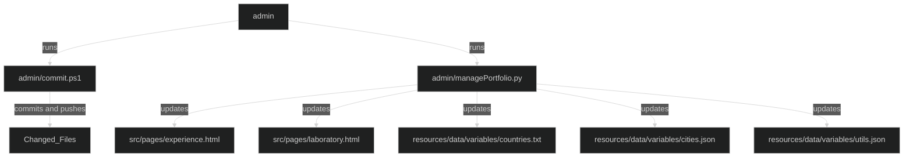

### Structure with Dependencies and Actions


```mermaid
%%{ init : { "theme" : "dark", "flowchart" : { "curve" : "stepBefore" }}}%%

graph TD
  %% FOLDER STRUCTURE
  A[Root Project] --> B1[.github/]
  B1 --> B1A[scripts/]
  B1A --> B1A1[update_structure.py]
  B1 --> B1B[workflows/]
  B1B --> B1B1[update-last-updated.yml]
  B1B --> B1B2[update-structure.yml]

  A --> B2[.gitignore]
  A --> B3[404.html]
  A --> B4[LICENSE]
  A --> B5[README.md]

  A --> C[admin/]
  C --> C1[commit.ps1]
  C --> C2[managePortfolio.py]

  A --> D[documentation/]
  D --> D1[instructions/]
  D1 --> D1A[instructions.md]
  D --> D2[structure/]
  D2 --> D2A[structure.md]
  D2 --> D2B[structure.txt]

  A --> E[index.html]

  A --> F[resources/]
  F --> F1[data/]
  F1 --> F1A[codes/]
  F1A --> F1A1[conquerer.py]
  F1A --> F1A2[ne_110m_admin_0_countries.zip]
  F1 --> F1B[variables/]
  F1B --> F1B1[cities.json]
  F1B --> F1B2[countries.txt]
  F1B --> F1B3[last-updated.txt]
  F1B --> F1B4[utils.json]
  F --> F2[images/]
  F2 --> F2A[experience/]
  F2 --> F2B[laboratory/]
  F2 --> F2C[misc/]
  F2C --> F2C1[favicon.png]
  F2C --> F2C2[world_map.png]

  A --> G[src/]
  G --> G1[pages/]
  G1 --> G1A[bio.html]
  G1 --> G1B[experience.html]
  G1 --> G1C[laboratory.html]
  G1 --> G1D[project_readme.html]
  G --> G2[scripts/]
  G2 --> G2A[experience.js]
  G2 --> G2B[globe.js]
  G2 --> G2C[laboratory.js]
  G2 --> G2D[script.js]
  G2 --> G2E[main.js]
  G2 --> G2F[lib/]
  G2F --> G2F1[Detector.js]
  G2F --> G2F2[Tween.js]
  G2F --> G2F3[jquery-2.1.0.min.js]
  G2F --> G2F4[three.min.js]
  G --> G3[styles/]
  G3 --> G3A[bio.css]
  G3 --> G3B[experience.css]
  G3 --> G3C[globe.css]
  G3 --> G3D[laboratory.css]
  G3 --> G3E[style.css]

  %% RELATIONSHIPS WITH LABELS
  F1B4 -->|cities_path| G2B
  F1B4 -->|map_path| G2B
  F1B4 -->|experience_classes| G2A
  F1B4 -->|project_classes| G2C
  F1B4 -->|structure_path_md| B1A1
  F1B4 -->|structure_path_txt| B1A1
  F1B4 -->|is loaded through| G2D
  B1A1 -->|updates| D2A
  B1A1 -->|updates| D2B
  B1B2 -->|runs| B1A1
  B1B1 -->|updates| F1B3
  F1A1 -->|updates| F1B2
  F1A1 -->|uses| F1A2
```

### Admin Actions and Affected Files


```mermaid
%%{ init : { "theme" : "dark", "flowchart" : { "curve" : "default" }}}%%

graph TD
admin -- runs --> admin/commit.ps1
admin/commit.ps1 --commits and pushes--> Changed_Files
admin -- runs --> admin/managePortfolio.py
admin/managePortfolio.py --updates--> src/pages/experience.html
admin/managePortfolio.py --updates--> src/pages/laboratory.html
admin/managePortfolio.py --updates--> resources/data/variables/countries.txt
admin/managePortfolio.py --updates--> resources/data/variables/cities.json
admin/managePortfolio.py --updates--> resources/data/variables/utils.json
```
---

```
Tejas' Codes :D
```
